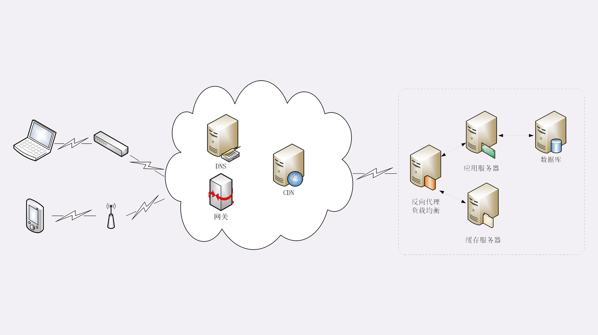

# 键入网址再按下回车，后面究竟发生了什么？

#### 抓包分析

​	

**浏览器那期HTTP请求的过程：**

1.浏览器从地址栏输入中获得服务器的IP地址和端口号；

2.浏览器用TCP的三次握手与服务器建立连接；

3.浏览器向服务器发送拼好的报文；

4.服务器收到报文后处理请求，同样拼好报文再发给浏览器；

5.浏览器解析报文，渲染输出页面。

#### 适用域名访问Web服务器

​	

#### 真实的网络世界

​	第一个场景，只有两个角色：浏览器和服务器，浏览器可以直接用IP地址找到服务器，两者直接建立TCP连接后发送HTTP报文通信。

​	第二个场景，在浏览器和服务器之外增加了一个DNS角色，浏览器不知道服务器的IP地址，所以必须要借助DNS的域名解析功能得到服务器的IP地址，然后才能与服务器通信。

​	真实的互联网世界比这两个场景要复杂的多。

​	

​	如果你用的是台式电脑台式机，那么你可能会使用带水晶头的双绞线连上网口，由交换机接入固定网络。如果你用的是手机、平板电脑，那么你可能会通过蜂窝网络、WiFi，由电信基站、无线热点接入移动网络。

​	接入网络的同时，网络运营商会给你的设备分配一个IP地址，这个地址可能是静态分配的，也可能是动态分配的。静态IP就始终不变，而动态IP可能你下次上网就变了。

​	假设你要访问的是Apple网站，显然你是不知道它的真实IP地址的，在浏览器里只能使用域名“www.apple.com”访问，那么接下来要做的必然是域名解析。这就要用DNS协议开始操作系统、本地DNS、根DNS、顶级DNS、权威DNS的层层解析，当然这中间有缓存，可能不会费太多时间就能拿到结果。

​	别忘了互联网上还有另外一个重要的角色CDN，它也会在DNS的解析过程中“插上一脚”。DNS解析可能会给出CDN服务器的IP地址，这样你拿到的就是CDN服务器而不是目标网站的实际地址。

​	因为CDN会缓存网站的大部分资源，比如图片、CSS样式表，所以有的HTTP请求就不需要再发到Apple，CDN就可以直接响应你的请求，把数据发给你。

​	由PHP、Java等后台服务动态生成的页面属于“动态资源”，CDN无法缓存，只能从目标网站获取。于是你发出的HTTP请求就要开始在互联网上的“漫步跋涉”，经过无数的路由器，构成一个更强稳定的集群。

​	负载均衡设备会先访问系统里的缓存服务器，通常有memory级缓存Redis和disk级缓存Varnish，它们的作用于CDN类似，不过是工作在内部网络里，把最频繁访问的数据缓存几秒钟或几分钟，减轻后端应用服务器的压力。

​	如果缓存服务器里也没有，那么负载均衡设备就要把请求发给应用服务器。这里就是各种开发框架大显神通的地方了，列如Java的Tomcat/Netty/Jetty，Python的Django，还有PHP、Node.js、Golang等等。它们又会再次访问后面的MySQL、PostgreSQL、MongoDB等数据库服务，实现用户登录、商品查询、购物下单、扣款支付等业务操作，然后把执行的结果返回给负载均衡设备，同时也可能给缓存服务器里也放一份。

​	应用服务器的输出到了负载均衡设备里，请求的处理就算是完成了，就要按照原路在走回去，还是要经过许多的路由器、网关、代理。如果这个资源允许缓存，那么经过CDN的时候他也会做缓存，这样下次同样的请求就不会到达源站了。

​	最后网站的响应数据回到了你的设备，它可能是HTML、JSON、图片或者其他格式的数据，需要由浏览器解析处理才能显示出来，如果数据里面还有超链接，指向别的资源，那么就又要重走一遍流程，知道所有的资源都下载完。

#### 小结

> ​	1.HTTP协议基于底层的TCP/IP协议，所以必须要用IP地址建立连接；
>
> ​	2.如果不知道IP地址，就要用DNS协议去解析得到IP地址，否则就会连接失败；
>
> ​	3.建立TCP连接后会顺序收发数据，请求方和应答方都必须依据HTTP规范构建和解析报文；
>
> ​	4.为了减少响应时间，整个过程中的每一个环节都会有缓存，能够实现“短路”操作；
>
> ​	5.虽然现实中的HTTP传输过程非常复杂，但理论上仍然可以简化成实验里的“两点”模型。

#### 补充

 	1. 除了80端口，HTTP协议还经常适用8000和8080。
 	2. 因为Chrome浏览器会缓存之前访问过的网站，所以当你再次访问“127.0.0.1”的时候它可能会直接从本地黄而不是服务器获取数据，这样就无法用Wireshark捕获网络流量，解决办法是在Chrome的开发工具或者设置里清除相关的缓存。
 	3. 现代浏览器通常会自动且秘密地发送favicon.ico请求。