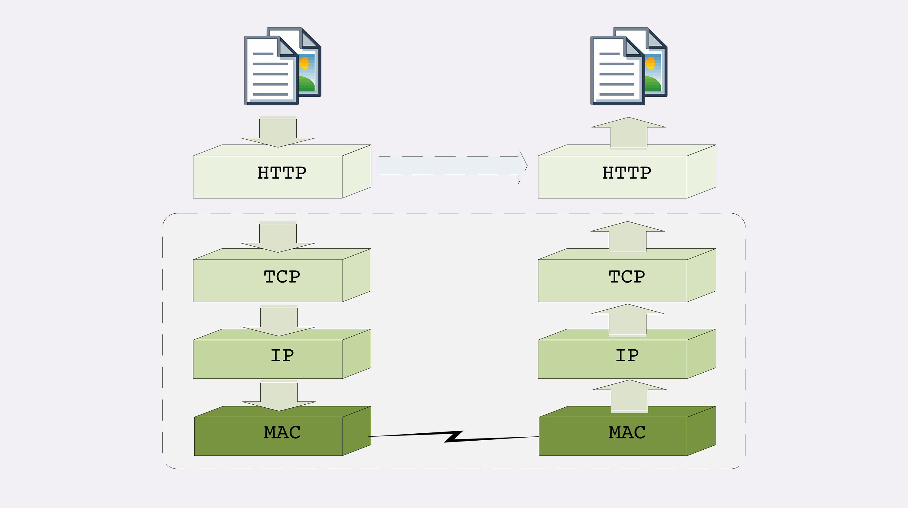

# 常说的“四层”和“七层”到底是什么？“五层”“六层”哪去了？

	#### TCP/IP 网络分层模型

​	

​	**层次顺序是“从下往上数的”**

​	第一层叫**“链接层”**（link layer）,负责在以太太网、WiFi 这样的底层网络上发送原始数据包，工作在网卡这个层次，使用 MAC 地址来标记网络上的设备，所以有时候也叫 MAC 层。

​	第二层叫**“网际层”或者“网络互连层”**（internet layer），IP协议就处在这一层。因为IP协议定义了“IP地址”的概念，所以就可以在“链接层”的基础上，用IP地址取代MAC地址，把许许多多的局域网、广域网连接成一个虚拟的巨大网络，在这个网络里找设备时只要把IP地址再“翻译”成MAC地址就可以了。

​	第三层叫**“传输层”**（transport layer），这个层次协议的职责是保证数据在IP地址标记的两点之间“可靠”地传输，是TCP协议工作的层次，另外还有它一个“小伙伴”UDP。

​	TCP是一个有状态的协议，需要先与对方建立连接然后才能发送数据，而且保证数据不丢失不重复。而UPD则比较简单，它无状态，不用事先建立连接就可以任意发送数据，但不保证数据一定会发到对方。两个协议的另一个重要区别在于数据的形式。TCP的数据是连续的“字节流”，有先后顺序，而UPD是分散的小数据包，是顺序发，乱序收。

​	协议栈的第四层叫“应用层”（application layer），由于下面的三层 吧把基础打得非常好，所以在这一层就“百花齐放”了，各有各面向具体应用的协议。列如**Telnet、SSH、FTP、SMTP等等**，当然还有HTTP。

​	MAC层的传输单位是帧（frame），IP层的传输单位是包（packet），TCP层的传输单位是段（segment），HTTP的传输单位则是消息或报文（message）。但这些名词并没有本质的区分，可以统称为数据包。

#### OSI 网络分层模型

​	**OSI，全称是“开放式系统互联通信参考模型”（Open System Interconnection Reference Model）。**

​	OSI模型分成了七层，部分层次与TCP/IP很像，从下到上分别是：

​	

 1.  第一层：物理层，网络的物理形式，例如电缆、光纤、网卡、集线器等等；

	2. 第二层：数据链路层，它基本相当于 TCP/IP 的链接层；

	3. 第三层：网络层，相当于 TCP/IP 里的网际层；

	4. 第四层：传输层，相当于 TCP/IP 里的传输层；

	5. 第五层：会话层，维护网络中的连接状态，即保持会话和同步；

	6. 第六层：表示层，把数据转换为合适、可理解的语法和语义；

	7. 第七层：应用层，面向具体的应用传输数据。

    ​

#### 两个分层模型的映射关系

​	OSI 在设计之初就参考了 TCP/IP 等多个协议，可以比较容易但不是很精确地实现对应关系。

​	

​	1.第一层：物理层，TCP/IP 里无对应；

​	2. 第二层：数据链路层，对应 TCP/IP 的链接层；

​	3. 第三层：网络层，对应TCP/IP的网际层；

 	4. 第四层：传输层，对应TCP/IP的传输层；

​	5. 第五、六、七层：统一应对到TCP/IP的应用层。

​	**所谓“四层负载均衡”就是指工作在传输层上，基于TCP/IP协议的特性，列如IP地址、端口号等实现对后端服务器的负载均衡。**

​	**所谓“七层负载均衡”就是指工作在应用层上，看到的是HTTP协议，解析HTTP报文里的URL、主机名、资源类型等数据，再用适当的策略转发给后端服务器。**

​	

#### TCP/IP协议栈的工作方式

​	

#### 总结

​	**1. TCP/IP分为四层，核心是二层的 IP 和三层的 TCP，HTTP 在第四层；**

​	**2. OSI 分为七层，基本对应 TCP/IP，TCP 在第四层，HTTP 在第七层；**

​	**3. OSI 可以映射到 TCP/IP，但这期间一、五、六层消失了;**

​	**4. 日常交流的时候我们通常使用 OSI 模型，用四层、七层等术语；**

​	**5. HTTP利用TCP/IP协议栈逐层打包再拆包，实现了数据传输，但下面的细节并不可见。**

​	**有一个辨别四层和七层比较好的（但不是绝对的）小窍门，“两个凡是”：凡是由操作系统负责处理的就是四层或四层以下，否则，凡是需要由应用程序（也就是你自己写代码）负责处理的就是七层。**

####补充

> ​	1. MAC地址（Media Access Control Address），也称为局域网地址，可以唯一地标识一个网卡，也就同时标识了此网卡所属的设备。
>
> ​	2. 在TCP/IP协议栈之外，还是有一些协议位于OSI“五层”和“六层”的，列如UNIX域或套接字就可以认为是在“五层”。

